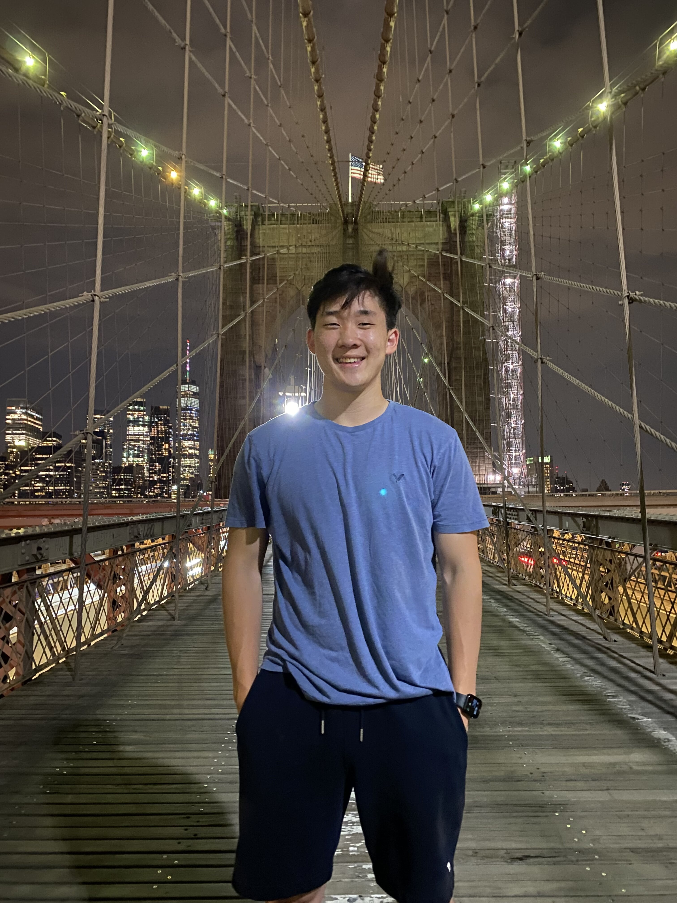
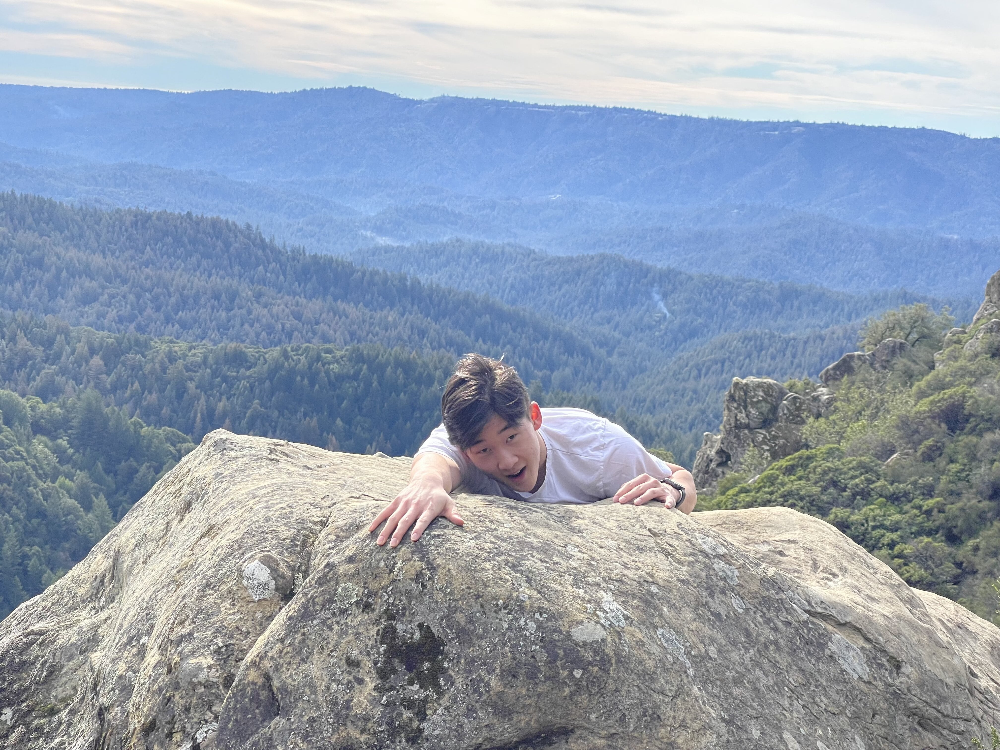

# ECE 4960: Design and Implementation of Fast Robots
Matthew Yang | CS 2024
Welcome to my website where you can find my labs for this course and some information about me.

---
## Labs

[Lab 1](./Labs/lab1.md)

---
## About Me

 

Hello! My name is Matthew Yang, an udergraduate student at Cornell University studying Computer Science. I am very excited to be in ECE 4960 as I am pursuing a minor in robotics.   
I am currently a part of the Cornell Baja project team, and am involved at Emmaus Road Church and the Cornell Men's Club Volleyball Team. Outside of school I like to fish, bike, cook, and play sports.

### Contact
Phone: (408) 332-3051   
Email: msy35@cornell.edu

<!-- 37/40, 62/40 -->

